# K2 Smart Heatsoak Calibration

Fixes inconsistent first layers on the Creality K2 Plus. Stock behavior calibrates on a cold machine, then heats — but the bed and frame expand while heating, so you print on an outdated calibration. This mod reverses the order: heat → soak → calibrate → print.

This mod assumes you're comfortable with root access and editing Klipper configs. If that's not you, this mod isn't for you (yet).

**What it does:**

- Parallel heating with bed assist (bed boosts to 105 °C near the nozzle → chamber reaches target much faster)
- Filament-driven heatsoak with on-screen countdown (45 min ASA/ABS, 15 min PLA/PETG)
- **Adaptive chamber cooling (PLA/PETG):** measures once per minute whether the chamber is still dropping. Stops at target, at a plateau (= ambient reached — e.g. a hot garage in summer), or at a hard cap. Can never hang indefinitely, unlike a bare `TEMPERATURE_WAIT`. The chamber fan runs at full speed during cooling.
- **Warm-restart detection — one strict rule for all filaments:** short soak only when a fresh *soak stamp* **and** warm temperatures agree. The stamp (written after every completed heatsoak; monotonic clock, valid 30 min, survives print cancels) proves a soak really happened — a boot self-check or a hot garage can fake temperatures, but never the stamp. The temperatures (ASA/ABS: chamber near target and bed ≥ 50 °C; PLA/PETG: bed ≥ 50 °C) confirm the machine hasn't cooled since. Any missing piece = full soak per the filament guideline, no exceptions. After a Klipper restart the stamp self-invalidates and the next start is always the full soak.
- Fresh nozzle clean + bed mesh after the soak, on the hot, stable machine
- Nozzle standby (140 °C) is applied *after* the cooling phase, not before — no heater fighting the cooldown
- All logic lives in one macro on the printer; the slicer only passes your filament profile values

**Improved start G-code (bundled):**

- Purge line lengthened from Creality's 50 mm to 125 mm (X80→X205 on the front strip)
- Fully parametric: line height = `first layer height + 0.1`, extrusion amounts and speeds scale along — works correctly with 0.6+ nozzles and thick first layers, and stays byte-identical to the tuned values at 0.2 mm
- Nozzle wipe ends at first-layer height instead of Z0 — fixes the stock bug where the nozzle presses filament into the bed at the end of the purge line (the wipe can now never be more aggressive than the first layer itself, regardless of Z-offset)

**Files:**

| File | Goes where |
|---|---|
| `smart_heatsoak_calibrate.cfg` (v2.2) | on the printer (via Fluidd) |
| `machine_start_gcode.gcode` (v1.3) | CrealityPrint → Machine start G-code |
| `fallback/creality-stock-original.gcode` | restore factory behavior (uninstall) |

## Flow (v2.2)

Every release keeps this diagram in sync with the macro — if the logic changes, the picture changes in the same commit.

```mermaid
flowchart TD
    A["Slicer start-gcode roept macro aan met<br/>EXTRUDER_TEMP / BED_TEMP / CHAMBER_TEMP<br/>(uit het geselecteerde filamentprofiel)"] --> A2["Klipper rekent de HELE macro nu al uit:<br/>profielwaardes + sensormetingen worden<br/>EENMALIG vastgelegd en staan verderop<br/>al als vast getal in de gcode.<br/>Ze kunnen dus nooit meer verloren gaan."]
    A2 --> B["Schone start:<br/>bed uit, nozzle uit<br/>(zet alleen de HEATERS uit,<br/>de vastgelegde waardes blijven)"]
    B --> C["Bewijs BEOORDELEN (lezen, niet schrijven):<br/>stempel_vers = is de stempel in het geheugen geldig?<br/>(klok &gt; 0 EN stempel &gt; 0 EN klok &gt; stempel<br/>EN leeftijd &lt; 30 min &mdash; uitkomst is vaak NEE)<br/>bed_warm = bed &ge; BED_TEMP − 10"]
    C --> D0{"Vangnet: CHAMBER_TEMP tussen 1 en 40?<br/>(fysiek onhaalbaar: firmware-heater<br/>start pas boven de 40)"}
    D0 -- "ja" --> D0a["Behandel als 0 + melding<br/>'Chamber onhaalbaar - koud-pad'"] --> D
    D0 -- "nee" --> D
    D{"CHAMBER_TEMP &gt; 0?<br/>= DOELwaarde uit het filamentprofiel,<br/>NIET de gemeten kamertemp —<br/>PLA in een garage van 38 &deg;C blijft koud-pad"}

    %% ========== CHAMBER-PAD ==========
    D -- "ja: ASA, ABS, PA-CF, PC, ..." --> E["Nozzle standby 140 &deg;C"]
    E --> F{"stempel_vers<br/>EN kamer &ge; CHAMBER_TEMP − 8<br/>EN bed_warm?"}
    F -- "alles waar" --> G["SOAK = 15 min<br/>'Stempel + temps warm'"]
    F -- "iets ontbreekt" --> H["SOAK = 45 min<br/>'Koude start'"]
    G --> I["Kamer aan (M141)<br/>bed-boost naar 105 &deg;C<br/>homen, Z5 voor convectie"]
    H --> I
    I --> J["M191: wacht tot kamer op doel<br/>(firmware, geen timeout!)"]
    J --> K["Bed terug naar BED_TEMP<br/>en wachten (M190)"]
    K --> L["Countdown SOAK minuten<br/>(scherm per 5 min, cancel &le; 1 s)"]

    %% ========== KOUD-PAD ==========
    D -- "nee: PLA, PETG, TPU, ..." --> M["Chamber heater uit (M141 S0)<br/>kamer wordt nooit verwarmd"]
    M --> N{"pla_koelen = 1<br/>EN kamer &gt; 35 &deg;C?"}
    N -- "ja" --> O["Kamerventilator vol aan<br/>koelloop starten"]
    N -- "nee" --> S["Nozzle standby 140 &deg;C<br/>(pas NA het koelen)"]
    O --> P{"Elke minuut meten<br/>(sub-macro: wordt pas bij UITVOERING<br/>gerenderd, dus dit is de enige plek<br/>met verse sensordata)"}
    P -- "kamer &le; 35" --> Q["'Kamer op doel' — stop"]
    P -- "zakt &lt; 0,3 &deg;C/min" --> R["'Plateau = omgeving bereikt'<br/>(warme garage) — stop"]
    P -- "zakt nog" --> P2["prev onthouden,<br/>1 minuut wachten"] --> P
    P -- "15 min plafond" --> R
    Q --> Fan["Fan terug naar firmware"]
    R --> Fan
    Fan --> S
    S --> T["Bed naar BED_TEMP<br/>en wachten (M190)"]
    T --> U{"stempel_vers<br/>EN bed_warm?"}
    U -- "beide waar" --> V["Countdown 5 min<br/>'Stempel + bed warm'"]
    U -- "iets ontbreekt" --> W["Countdown 15 min<br/>(volle soak, geen excuses)"]

    %% ========== GEZAMENLIJK EINDE ==========
    L --> X["_HEATSOAK_STAMP: de ENIGE plek waar<br/>de stempel wordt GESCHREVEN<br/>&rarr; gcode-variabele in het geheugen,<br/>geen bestand (alleen na AFGERONDE soak)"]
    V --> X
    W --> X
    X --> Y["Verse mesh op hete, stabiele machine<br/>(BED_MESH_CALIBRATE_START_PRINT)"]
    Y --> Z["START_PRINT<br/>terug naar Creality's routine<br/>&rarr; slicer purge-lijn &rarr; print"]

    style A2 fill:#d7bde2,stroke:#6c3483,color:#1c2128
    style D0 fill:#f9e79f,stroke:#b7950b,color:#1c2128
    style D fill:#f9e79f,stroke:#b7950b
    style F fill:#f9e79f,stroke:#b7950b
    style U fill:#f9e79f,stroke:#b7950b
    style N fill:#f9e79f,stroke:#b7950b
    style P fill:#aed6f1,stroke:#2471a3
    style X fill:#a9dfbf,stroke:#1e8449
    style J fill:#f5b7b1,stroke:#943126
```

## Install

### A. Prepare (one-time checks)

1. CrealityPrint → printer settings → **Print Calibration toggle OFF**.
2. Check `printer.cfg` contains `forced_leveling: false`.
3. Every ASA/ABS filament profile: chamber temperature **45 or higher**. Below 41 the printer never turns the heater on (it only runs a fan), so lower values silently do nothing.
4. Backup your current Machine start G-code to a text file.

### B. Macro on the printer

5. Fluidd → Configuration → create new file: `smart_heatsoak_calibrate.cfg`
6. Paste the contents of `smart_heatsoak_calibrate.cfg` → save.
7. Open `printer.cfg` → add near the other includes: `[include smart_heatsoak_calibrate.cfg]` → save.
8. Click **Firmware restart**.
9. Console smoke test: `SMART_HEATSOAK_CALIBRATE BED_TEMP=60 CHAMBER_TEMP=0 EXTRUDER_TEMP=200` — cooling/countdown messages appear = macro works. Cancel it.
10. Optional clock check: run `START_TIMER` in the console. `ns = <large number>` = the soak stamp works fully. `ns = 0` = your firmware lacks Creality's monotonic clock; everything degrades gracefully to the temperature-only check. Nothing breaks either way.

### C. Slicer

11. CrealityPrint → printer settings → Machine start G-code → select all → paste the contents of `machine_start_gcode.gcode` → save profile.
    *(Unlike earlier versions of this mod, nothing needs to be added to the Machine **end** G-code — the soak stamp is written by the start macro itself, right after the soak completes. If you previously added `SMART_HEATSOAK_MARK_END` there, you may remove it; a harmless stub keeps it from erroring if you don't.)*
12. **Re-slice your model** (old sliced files still contain the old start code).
13. Print. Watch the first purge line once — it now starts further left (X80).

**Expected screen sequence (PLA, warm day):** `Kamer koelen (nu 38.3 C)` → `Koelen: 38.1 C` → `Kamer zakt niet meer - omgeving is ~38.1 C, doorgaan` → `Heatsoak: nog 15 min` → `Kalibreren...` → print starts.
**Expected sequence (ASA, cold start):** `Koude start - soak 45 min` → `Kamer opwarmen...` → `Bed terug naar profieltemp` → `Heatsoak: nog 45 min` (counts down per 5 min) → `Kalibreren...` → print. On a warm restart, the soak shows 15 (ASA) or 5 (PLA) minutes instead.

OrcaSlicer: step 11 is identical — same field (printer settings → Machine G-code → Machine start G-code), same variables. This guide uses CrealityPrint naming.

## Why these soak times?

| Filament | Chamber | Soak | Reason |
|---|---|---|---|
| PLA / PETG (chamber = 0) | cooled toward < 35 °C first (bounded, adaptive) | 15 min cold / 5 min warm restart | Only the bed heats (50–80 °C); a light plate settles fast. Chamber heat is actively avoided — PLA softens near 55 °C (the chamber is never *heated* for PLA; cooling is a quality choice, switchable via `pla_koelen`). If ambient is above 35 °C, cooling is physically impossible; the plateau detection recognizes this within ~1 minute and proceeds (PLA prints fine at a 38 °C chamber). |
| ABS / ASA (chamber 45–60) | 55–60 °C | 45 min cold / 15 min warm restart | The whole frame, gantry and Z screws expand with the chamber. These heavy parts heat slowly; measurable Z drift typically stops after 30–45 min. |

These are deliberately conservative defaults, not magic numbers. Measure your own machine: once at temperature, run `PROBE_ACCURACY` every 10 minutes — the moment the Z value stops shifting is your minimum soak. Because this mod meshes after the soak, a somewhat shorter soak is far more forgiving than on stock (late drift is partly absorbed by the fresh mesh).

**Tuning:** all values (soak times, boost temp, warm-restart thresholds, cooling cap `koel_max`, plateau sensitivity `koel_delta`, stamp validity window `stempel_venster`) are in the `_SMART_HEATSOAK_VARS` block at the top of the cfg. Change one number, firmware restart, done.

## FAQ

**Can I leave Print Calibration ON?** It works — our hot mesh overwrites the cold one — but you waste ~10 minutes, and the AI flow scan (run on a cold machine) may override your tuned profile flow with a guess made under the wrong conditions. Recommended: OFF.

**Bed shows 105 °C at the start?** That's the bed assist speeding up chamber heating. It returns to your profile temp before the soak clock starts. You never calibrate or print on the 105 shape.

**"Kamer zakt niet meer - omgeving is ~38 C"?** Working as intended. Your room is warmer than the 35 °C target, so cooling further is physically impossible; the macro detects the plateau within a minute and proceeds instead of waiting forever (which is exactly what the naive `TEMPERATURE_WAIT` approach did).

**I cancelled a print right after the heatsoak — do I lose 45 minutes on the next start?** Not if you restart promptly. The soak stamp is written the moment the soak completes, independent of how the print ends; restart within the stamp window (default 30 min, same Klipper session) *while the bed is still ≥ 50 °C* and you get the short soak. Once the bed has cooled below 50 the machine gets the full soak again — strict by design. Cancelling *during* the soak deliberately does not stamp.

**Soak was only 5 minutes right after powering on?** Fixed (v1.9). The firmware's boot self-check heats the bed, and a hot room heats the chamber — both used to fool the temperature-based warm-restart check. Since v1.9 every filament path shortens only when a fresh soak stamp *and* warm temperatures agree; run `HEATSOAK_STATUS` in the console to see exactly which soak the next start will get and why.

**Printer calibrated instantly after a reboot, skipping everything?** That's the firmware's own self-check after restart (also after emergency stop) — not this mod. Its cold mesh is replaced by the fresh hot mesh after the soak.

**`Unknown command: SMART_HEATSOAK_CALIBRATE` after a firmware update?** The update wiped the macro/include. Redo install steps 5–8 (takes ~5 minutes). Need to print right now? Paste `fallback/creality-stock-original.gcode` temporarily. Note this failure mode is safe by design: the print aborts immediately instead of silently starting cold.

**Cancel takes long?** During the soak and the cooling phase: ~1 second (both pause per second). During chamber heating (`M191`): a normal cancel waits for the chamber target — use Fluidd's emergency stop for instant abort. `M191` is firmware and has no timeout; don't set unreachable chamber temps in filament profiles.

**45 min too long?** It's conservative on purpose. Measure your machine (see above), then change one variable in the cfg.

**Cache the mesh to skip probing?** Don't. Bed shape follows current temperature; a cached hot mesh is wrong after any cool-down or plate removal. Probing costs ~2 min.

**Uninstall / back to stock?** Paste `fallback/creality-stock-original.gcode` into Machine start G-code, turn the Print Calibration toggle back ON, re-slice. Optionally remove the include line from `printer.cfg`. Nothing else to clean up — the mod writes no files.

**Multicolor/CFS?** Fully supported — the purge block stays in the slicer g-code, included and improved (see start G-code notes above).

**K2 Pro?** Same firmware family and chamber commands, should work identically — untested. Base K2 is not supported for ASA/ABS (no active chamber heater).

## Credits

The soak stamp borrows Creality's own clock: `printer.system_stats.monotonic`, the field their stock `START_TIMER`/`END_TIMER` macros use in `gcode_macro.cfg` — that's where the discovery came from that a usable (monotonic) clock exists in this firmware at all. The timing pattern is theirs; the stamp keeps the clock value in a gcode variable exactly as they do — no file is written — and adds a validity window plus restart detection. An earlier version stored it on disk via `save_variables`; that turned out to buy nothing, since the monotonic clock already limits validity to a single Klipper session.

Bed-assist concept and calibrate-after-stability principle inspired by [Jacob10383/k2-improvements](https://github.com/Jacob10383/k2-improvements) — reimplemented without invasive firmware mods, without the bed-stuck-at-105 issue, extended with filament-driven soak, adaptive plateau-detecting chamber cooling, dual-signal warm-restart detection (soak stamp + residual bed heat) and a parametric, longer purge line with a safe wipe.

Tested on: Creality K2 Plus, CrealityPrint 7.2, CFS. Report your firmware + CrealityPrint version in issues.
